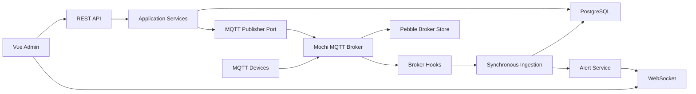

# mqtter

mqtter 是一个 MQTT 设备管理后台，同时内嵌 MQTT Broker。第一版聚焦通用设备管理、消息历史、后台发布、定时发布，以及 `GSCU1B` 智能红外控制器的设备能力和快捷操作。

## 功能

- 内嵌 Mochi MQTT Broker，支持 MQTT retained message、persistent session、subscription、inflight message 持久化。
- 设备默认以 MQTT ClientID 识别，新接入设备会自动创建为 `unknown` 类型。
- 管理后台展示设备在线状态、设备订阅主题、发布主题和消息历史。
- 设备发布消息时先同步写入 PostgreSQL，成功后才允许 Broker 路由。
- PostgreSQL 负载或写入异常时会产生系统告警，避免历史消息静默丢失。
- 管理后台可以向具体 MQTT topic 发布文本 payload。
- 支持一次性、每天、按周循环的定时发布任务。
- 支持手动把设备类型改为已知设备类型。
- 已内置 `GSCU1B` 智能红外控制器能力：
  - 红外发射、擦除、学习、取消学习、读取、写入。
  - 设备信息、重启、恢复出厂、WiFi 配网锁、自定义 MQTT/TCP 配置。
  - 快捷操作：自定义名称和红外码编号，一键执行“发射学习过的红外码”。
  - 快捷操作可直接创建定时任务，复用该快捷操作的 topic、payload、QoS 和 retain。

## 架构



后端是 Go 单体模块化架构：

- `cmd/mqtter-server`: 服务入口，启动 HTTP API、MQTT Broker、定时任务调度。
- `cmd/mqtter-migrate`: 数据库迁移入口。
- `internal/api`: REST API、鉴权中间件和 WebSocket 路由。
- `internal/broker`: Mochi Broker 封装和 hook。
- `internal/domain`: 领域模型、校验和调度规则。
- `internal/service`: 应用服务，承载业务规则。
- `internal/storage/postgres`: PostgreSQL repository 和迁移。
- `internal/realtime`: WebSocket 事件推送。
- `frontend`: Vue 3 + TypeScript 管理后台。

## 数据存储

- PostgreSQL：设备、设备类型、主题、消息历史、发布审计、定时任务、快捷操作、告警、后台用户和 session。
- Pebble：Broker retained message、persistent session、subscription、inflight message。
- 消息历史表 `mqtt_messages` 按月分区，默认查询最近 24 小时。
- 第一版只支持文本 payload，UTF-8/JSON 会按文本保存；暂不支持二进制 payload。

## 环境要求

- Go 1.21+，建议 Go 1.23+
- Node.js 18+
- PostgreSQL 14+

## 配置

通过环境变量配置后端：

| 变量 | 说明 | 默认值 |
| --- | --- | --- |
| `MQTTER_DATABASE_URL` | PostgreSQL 连接串，必填 | 空 |
| `MQTTER_HTTP_ADDR` | HTTP API 监听地址 | `:8080` |
| `MQTTER_MQTT_ADDR` | MQTT Broker 监听地址 | `:1883` |
| `MQTTER_BROKER_STORE_PATH` | Pebble Broker 数据目录 | `data/broker-pebble` |
| `MQTTER_INGEST_TIMEOUT` | MQTT 入库超时 | `2s` |
| `MQTTER_SCHEDULER_INTERVAL` | 定时任务扫描间隔 | `10s` |
| `MQTTER_MAX_PAYLOAD_BYTES` | 文本 payload 最大字节数 | `262144` |
| `MQTTER_SESSION_COOKIE` | 后台 session cookie 名称 | `mqtter_session` |
| `MQTTER_SESSION_TTL` | 后台 session 有效期 | `24h` |
| `MQTTER_BOOTSTRAP_ADMIN_USERNAME` | 首次启动时创建的管理员账号 | 空 |
| `MQTTER_BOOTSTRAP_ADMIN_PASSWORD` | 首次启动时创建的管理员密码 | 空 |

示例：

```powershell
$env:MQTTER_DATABASE_URL = "postgres://postgres:<password>@127.0.0.1:5432/postgres?sslmode=disable"
$env:MQTTER_BOOTSTRAP_ADMIN_USERNAME = "admin"
$env:MQTTER_BOOTSTRAP_ADMIN_PASSWORD = "change-me"
```

## 启动

后端：

```powershell
go mod tidy
go run ./cmd/mqtter-migrate
go run ./cmd/mqtter-server
```

前端：

```powershell
cd frontend
npm install
npm run dev
```

默认访问地址：

- 管理后台: `http://127.0.0.1:5175/`
- HTTP API: `http://127.0.0.1:8080/`
- MQTT Broker: `127.0.0.1:1883`

## 后台使用

1. 登录后台。
2. 在设备列表查看设备在线状态、类型、最后活跃时间。
3. 新接入设备默认为 `unknown`，可通过“类型”操作改为已知设备类型。
4. “主题”可以查看设备已订阅和已发布过的主题。
5. “消息”可以查看设备消息历史。
6. “发布”可以向具体 topic 发布文本消息。
7. “定时”可以创建一次性、每天或按周循环的发布任务。
8. `GSCU1B` 设备会额外显示“能力”和“快捷”：
   - “能力”用于直接发送红外控制器支持的能力指令。
   - “快捷”用于保存常用红外发射动作，可执行、删除，也可直接创建定时执行任务。

## API 概览

所有管理接口除 `POST /api/auth/login` 外都需要 HttpOnly session cookie。

| Method | Path | 说明 |
| --- | --- | --- |
| `POST` | `/api/auth/login` | 登录并设置 session cookie |
| `POST` | `/api/auth/logout` | 退出登录 |
| `GET` | `/api/me` | 当前后台用户 |
| `GET` | `/api/devices` | 设备列表，支持 `status/type/q/page/pageSize` |
| `GET` | `/api/devices/{deviceId}` | 设备详情 |
| `PATCH` | `/api/devices/{deviceId}/type` | 修改设备类型 |
| `GET` | `/api/devices/{deviceId}/topics` | 某设备观察到的主题 |
| `GET` | `/api/topics` | 全局主题列表 |
| `GET` | `/api/messages` | 消息历史，默认最近 24 小时 |
| `POST` | `/api/publish` | 向具体 topic 发布文本 payload |
| `GET` | `/api/commands` | 发布命令审计 |
| `GET` | `/api/scheduled-publishes` | 定时发布任务列表 |
| `POST` | `/api/scheduled-publishes` | 创建定时发布任务 |
| `POST` | `/api/scheduled-publishes/{taskId}/cancel` | 取消定时发布任务 |
| `GET` | `/api/quick-actions` | 快捷操作列表 |
| `POST` | `/api/quick-actions` | 创建或覆盖快捷操作 |
| `DELETE` | `/api/quick-actions/{actionId}` | 删除快捷操作 |
| `POST` | `/api/quick-actions/{actionId}/execute` | 执行快捷操作 |
| `GET` | `/api/alerts` | 系统告警 |
| `GET` | `/api/device-types` | 设备类型列表 |
| `GET` | `/api/realtime` | WebSocket 实时事件 |

统一错误格式：

```json
{
  "error": {
    "code": "invalid_topic",
    "message": "publish topic must not contain wildcards",
    "requestId": "..."
  }
}
```

## 快捷操作数据

快捷操作目前仅开放给 `GSCU1B` 智能红外控制器。新增快捷操作时，前端会生成红外发射 payload：

```json
{
  "action": "emit",
  "data": {
    "no": 110
  },
  "type": "infrared"
}
```

同一个设备下相同名称的快捷操作会保存为覆盖更新，方便调整红外码编号或 topic。

## 测试

```powershell
go test ./...
cd frontend
npm run build
```

如果本机默认 `go` 版本过低，可以指定高版本 Go：

```powershell
E:\go1.23.0\bin\go.exe test ./...
```

## 注意事项

- 生产环境必须使用强密码，并保护 `MQTTER_DATABASE_URL`。
- `data/broker-pebble` 是 MQTT 标准行为相关持久化数据，部署时需要随服务数据一起备份。
- 当前为单节点 Broker 设计。
- `POST /api/publish` 和快捷操作执行只允许具体发布 topic，不允许通配符，也不允许 `$SYS` topic。
- 二进制 payload 暂不支持。
