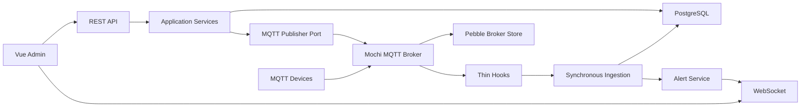
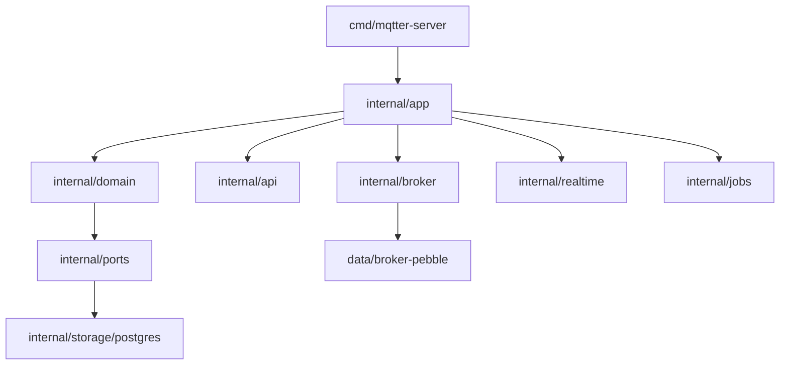

# Backend Architecture

## Runtime

## Modules

## API

All management routes except `POST /api/auth/login` require the HttpOnly session cookie.

| Method | Path | Purpose |
|---|---|---|
| `POST` | `/api/auth/login` | Login and set the session cookie |
| `POST` | `/api/auth/logout` | Delete the current session |
| `GET` | `/api/me` | Current admin user |
| `GET` | `/api/devices` | Device list with `status/type/q/page/pageSize` |
| `GET` | `/api/devices/{deviceId}` | Device detail |
| `PATCH` | `/api/devices/{deviceId}/type` | Change device type |
| `GET` | `/api/devices/{deviceId}/topics` | Observed topics for one device |
| `GET` | `/api/topics` | Global observed topics |
| `GET` | `/api/messages` | Message history; defaults to the last 24 hours |
| `POST` | `/api/publish` | Publish a text payload to a concrete topic |
| `GET` | `/api/commands` | Publish command audit list |
| `GET` | `/api/alerts` | System alerts, including overload alerts |
| `GET` | `/api/device-types` | Registered device types |
| `GET` | `/api/realtime` | WebSocket event stream |

## Testability

- HTTP handlers depend on small interfaces in `internal/api`.
- MQTT hooks depend only on `BrokerIngestor`.
- Services depend on repository and publisher ports from `internal/ports`.
- PostgreSQL code is isolated in `internal/storage/postgres`.
- Time, IDs, MQTT publish, password hashing, alerts, and realtime events are injected for tests.
